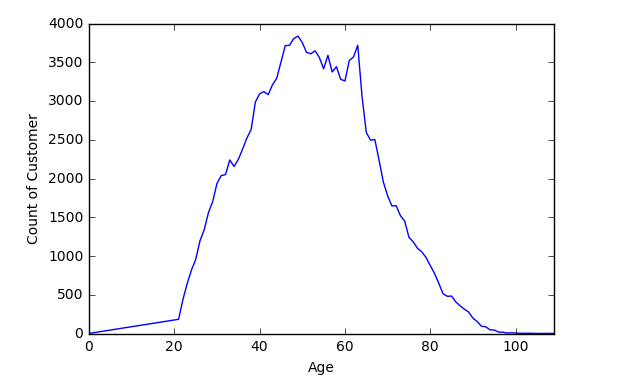
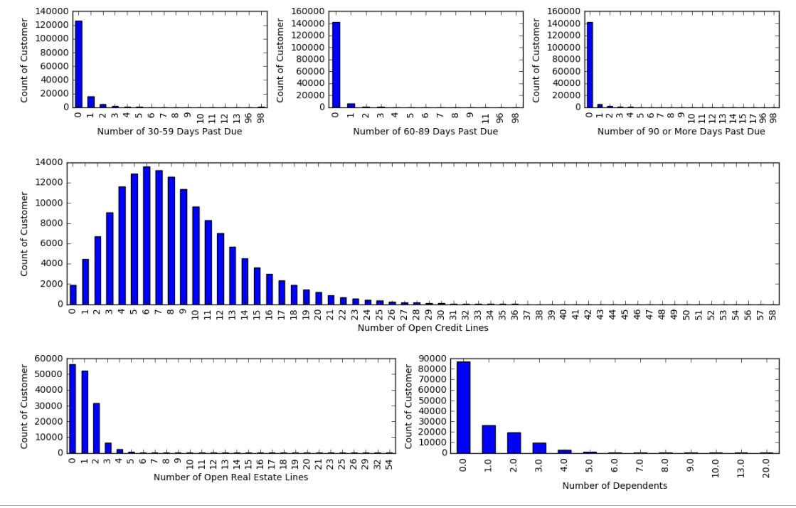
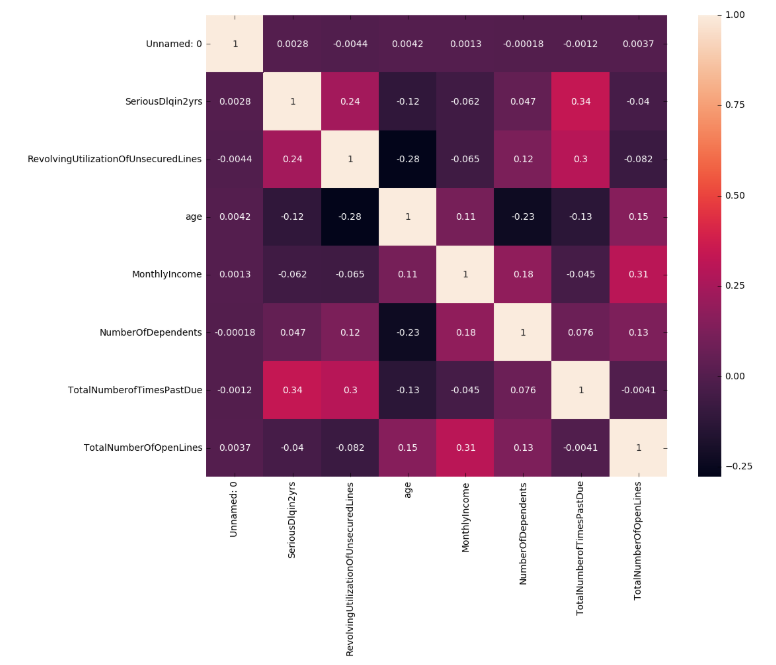

# Credit Scoring Algorithm and Its Implementation in Production Environment :hand: fa18-523-83

| Nhi Tran
| nytran@iu.edu
| Indiana University
| hid: fa18-523-83
| github: [:cloud:](https://github.com/cloudmesh-community/fa18-523-83/blob/master/project-report/report.md)
| code: [:cloud:](https://github.com/cloudmesh-community/fa18-523-83/blob/master/project-code/)

## Abstract

A credit scoring algorithm is essential to help any bank determine whether to authorize a loan to consumers. Most of the decisions require fast results and high accuracy in order to improve the bank customer satisfaction and profit. Choosing a correct machine learning algorithm will result in high accuracy in the prediction and a reasonable implementation of the algorithm will result in the fast service a bank can provide to its customers.

## Keywords

fa18-523-83, machine learning, predict algorithm, classification, devops, optimization, API

 
## Introduction

For every machine learning problem, there are normally two main areas that everyone focuses on: which machine learning algorithms to use and how to implement and integrate the machine learning code into existing production infrastructure.

Most of the time, machines make predictions by learning and observing the data patterns from previously existing data with known results. Once the training is over, the machine learning code can then be applied to new data and predict the unknown results by applying the trained patterns and algorithms.

The next thing to do after prediction would be determining how to retrieve and apply the result of the prediction into a new or existing production application and how to ensure the continuous deployment into the production environment without resulting deployment code defects.

The business problem is how to determine in real-time whether or not a customer will be experiencing financial distress in the next two years. By predicting the business problem, banking companies can use the results as part of their business rules to decide whether to approve their products to the customer.  

## Design

 

### Dataset

We are utilizing an existing dataset from the 'Give Me Some Credit' competition on Kaggle to train and test algorithms and determine which algorithms would be the best to predict the probability of someone experiencing financial distress in the next two years [@fa18-523-83-credit-dataset].

The Kaggle competition contains a training set, a test set, and a data dictionary. The training set contains 150,000 records of previous customer data with an existing label indicating whether or not each customer had serious bank delinquency within two years. The test set contains about 100,000 records without any label data, which will not be part of the analysis but will be used as part of the benchmarking report.
 
Data descriptions [@fa18-523-83-www-gmsc-kaggle-data] :
*  *SeriousDlqin2yrs*: label data, contains 'Yes' or 'No' indicator 
*  *RevolvingUtilizationOfUnsecuredLines*: total balance of unsecured lines such as credit cards and personal lines
*  *age*: bank customers' age
*  *NumberOfTime30-59DaysPastDueNotWorse*: number of times each customer has been 30-59 days past due but no worse in the last 2 years
*  *DebtRatio*: monthly debt payments divided by monthly gross income
*  *MonthlyIncome*: bank customers' monthly income
*  *NumberOfOpenCreditLinesAndLoans*: number of open loans and lines of credit 
*  *NumberOfTimes90DaysLate*: number of times each customer has been 90 days or more past due
*  *NumberRealEstateLoansOrLines*: number of mortgage and real estate loans
*  *NumberOfTime60-89DaysPastDueNotWorse*: number of times each customer has been 60-89 days past due but no worse in the last 2 years
*  *NumberOfDependents*: number of dependents in family excluding themselves (spouse, children etc.)

### Data Visualization

Using the `describe()` function in Python *pandas* package, the statistics for each attributes within training dataset is populated. The statistics include count, mean, standard deviation, minimum, quantiles, and maximum. The function helps with seeing outliers and identifies values or columns that need to be cleaned up. For example, in the training set, some areas that will need to be carefully examined are *age* with minimum value of 0, *MonthlyIncome* and *NumberOfDependents* contains *NaN* value in their quantiles. 

|       |                    |                    |                    | 
|-------|--------------------|--------------------|--------------------| 
|       | age                | MonthlyIncome      | NumberOfDependents | 
| count | 150000.0           | 120269.0           | 146076.0           | 
| mean  | 52.295206666666665 | 6670.221237392844  | 0.7572222678605657 | 
| std   | 14.77186586310081  | 14384.674215282244 | 1.1150860714872997 | 
| min   | 0.0                | 0.0                | 0.0                | 
| 25%   | 41.0               | NaN                | NaN                | 
| 50%   | 52.0               | NaN                | NaN                | 
| 75%   | 63.0               | NaN                | NaN                | 
| max   | 109.0              | 3008750.0          | 20.0               | 

Data Visualization in Python can be done using graphing packages such as *matplotlib*, *seaborn*, etc.

Using *matplotlib*, +fig:agecounttraining shows that there is a small count of '0' value as outliers and the distribution without those outliers will be a right-skewed distribution. Therefore, it is better to replace those outliers with the median value of the distribution.

{#fig:agecounttraining}

+fig:attributescounttraining shows overall distribution of the count of customers that experienced past due, the count of customers that have open credit and real estate lines , and the count of customers that have dependents other than themselves. Most of the distribution are right-skewed, majority of them do not have any past due, or dependents.

{#fig:attributescounttraining}

+fig:labeldistribution shows the distribution of the label that will be what the machines are trying to predict. If the label distribution is not even, the model might overfit and give a higher chance of predicting the label that has higher population. In this case, the amount of customers that had no delinquency is 14 times more than the amount of customers that had delinquency. This issue will need to be handled during the *Data Cleaning* or *Model Training* process to avoid overfitting.

{#fig:labeldistribution}

### Data Preperation
 
From the *Data Visualization* step, the first basic data preperation are replacing missing value with median value. Another way to handle this issue is to drop records that has missing data, however, due to low data volumes and imbalanced class data distribution, it is better to replace missing data instead. 

Using *seaborn*, *heatmap* can be used to visualized the correlation of all attributes. Correlation is a measurement of the strength of association between two variables and the relationship's direction [@fa18-523-83-www-correlation-stats]. Correlation is an important indicator in the Feature Selection process to help determine which attributes should be used as part of training set and which attributes should be irrelevent. There are multiple correlation methods to calculate correlation coefficient, the method that is used for this training set is called *Spearman*. +fig:correlation1 shows the first observation of the correlation between all variables.

{#fig:correlation1}

From +fig:correlation1, *DebtRatio* has very low correlation to the class label. It means that the debt ratio of a customers does not impact on whether a customers will be likely to default in the next 2 years. At the same time, the *DebtRatio* variable is highly correlate with the number of open credit lines and real estate loans, which could potentially interrupt the training algorithms and result in a false prediction. Therefore, it is better to exclude *DebtRatio* out of the final dataset.

Another obsevation from +fig:correlation1 is that all number of past due variables have high impact on the class label and between themselves at the same time. Since they are all past due type of data, adding them all into a new variable called *TotalNumberOfPastDue* and dropping all individual past due variables could be a good idea to avoid conflicting between those variables. 

Similar to past due variables, *NumberOfOpenCreditLinesAndLoans* and *NumberOfRealEstatesLoansOrLines* are highly correlated to each other, therefore, adding them together into a new variable called *TotalNumberOfOpenLines* is a way to solve the problem. 

Once all of the new variables are added and individually variables are removed, it is good to run the *heatmap* again to determine whether or not there are more cleaning to be done. +fig:correlation2 is the second *heatmap* run with all prepared variables.

{#fig:correlation2}

The final observation is that *MonthlyIncome* and the new variables *TotalNumberOfOpenLines* are also high correlated to each other. Since *MonthlyIncome* has a higher correlation than *TotalNumberOfOpenLines*, the last step to have a final training dataset is to drop *TotalNumberOfOpenLines*.

### Model Training

Because the training data has imbalanced classes, there are multiple ways to handle this issue:

* Methods that will be used [@fa18-523-18-www-imbalanced-classes]: 

     * *Changing Performance Metric*: instead of using only *Accuracy* as the main performance metric to evaluate models, try to include other metrics such as *Confusion Matrix*, *Precision*, *Recall*, *F1 Score*, *Kappa*, *ROC Curves*. 
      
     * *Resample Dataset*: add copied of instances from low volume class as over-sampling method, or delete instances from high volume class as under-sampling method, or re-run the algorithm on shuffled data (k-fold cross validation). Under-sampling and cross-validation are used as part of the training process for this problem and will be included as part of the result evaluation section.
      
     * *Different Algorithms*: run data on multiple algorithms and evaluate and choose the best algorithms that fit the provided data.
      
     * *Penalized Models*: Use penalized methods to cause the model to pay more attentions to the minority class to evaluate.
      
* Methods that will not be used [@fa18-523-18-www-imbalanced-classes]: 

     * *Increase Training Data*: gaining more data to provide more balance and insights in data. 
      
     * *Generate Synthetic Samples*: use popular algorithms such as Synthetic Minority Over-sampling Technique to generate synthetic data. 

 
The goal is to determine whether someone will experience financial distress in the next two years, therefore, there will only be valuable in the label: Yes or No. With a binary classification problem on supervised data, it is best to use classification algorithms such as Random Forest, XGBoost, LightGBM, Support Vector Machine, Logistic regression.

* *Random Forest*: an ensemble of Decision Tree algorithm, builds and merge multiple decision trees together to get average results for prediction [@fa18-523-83-www-random-forest] 

* *Binary Logistic Regression*: uses an equation with weights for coefficient values of input values to make prediction. For Binary Logistic Regression, a threshold between 0 and 1 is needed to determine the category of the prediction [@fa18-523-83-www-logistic-regression] 

* **XGBoost**:
* **LightGBM**:
* **Support Vector Machine**:

### Result Comparison

 

## Implementation

 

### Technologies Used

#### Kaggle API

Kaggle API provides the ability to pull and push data from Kaggle website using command tool implemented in Python 3. The Kaggle API github page provide detailed Installation, API credentials and commands instruction [@fa18-523-83-www-kaggle-api-github]. 

#### Python and Python Packages

#### Flask API

#### Docker

#### AWS EC2

## Results

### Deployment Benchmarks

### Application Benchmarks

## Limitations

## Conclusion

## Acknowledgements

 
## References
